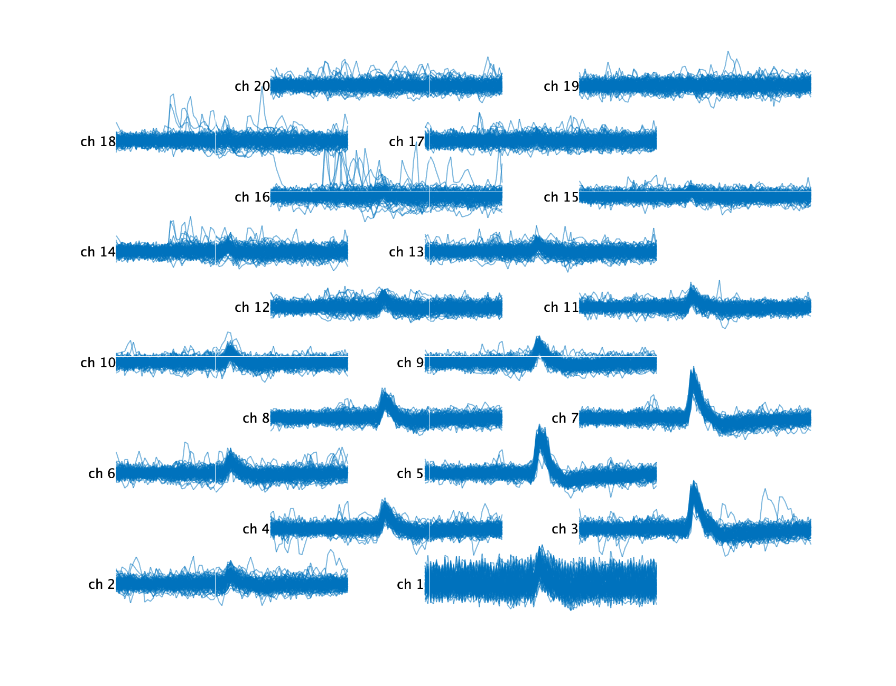
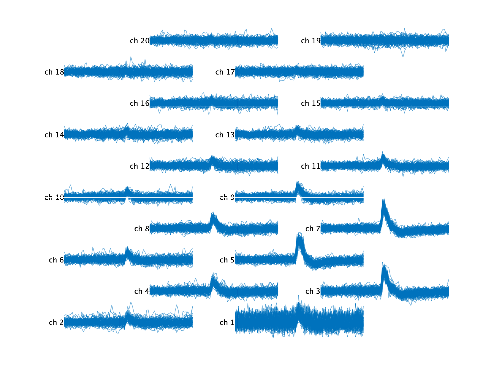

# Extracting raw waveforms

## Extracting datasnippets from ImecDataset

It is often useful to extract small windows of time from the raw data on each channel. Given a list of sample indices `times` you want to extract a window of time around, and a `window = [offsetPre, offsetPost]` of relative samples to collect around those times, you can do the following:

```matlab
>> times = 1e5:1e5:1e6;
>> window = [-1000, 999]; % 1000 samples before plus 999 samples after
>> snippetSet = imec.readAPSnippetSet(times, window)

snippetSet =

  SnippetSet with properties:

                      data: [384×2000×10 int16] % nChannels x nTimepoints x nSnippets snippet data
               cluster_ids: [10×1 uint32]
    channel_ids_by_cluster: [384×1 uint32] % nChannels x nClusters channel ids, which channel ids were extracted for each cluster
        unique_cluster_idx: 1
                sample_idx: [10×1 uint64]
                 trial_idx: [0×1 uint32]
                    window: [-1000 999]
                     valid: [10×1 logical]
                channelMap: [1×1 npxutils.ChannelMap]
                 scaleToUv: 2.3438
                        fs: 30000
                 nChannels: 384
               nTimepoints: 2000
                 nSnippets: 10
                 nClusters: 1
                data_valid: [384×2000×10 int16]

```

## Extracting waveforms via KilosortDataset

With this functionality in place, it is very easy to extract raw waveforms from the original `ImecDataset` guided by a `KilosortDataset` to provide the spike times. From a `KilosortDataset`, you can request waveforms based on one of:

* `spike_idx` : index directly into `spike_times`
* `spike_times` : find spikes that match times in `spike_times`
* `cluster_ids` : find all spikes from a given cluster. Often, you would also specify `'num_waveforms'` to cap the total number of waveforms per cluster via random sample, unless you want _every_ spike for those clusters

By default, waveforms will be extracted for every channel on the probe, unless you request specific `channel_ids_by_cluster` as a `nClusters` x `nChannels` matrix, or specify `best_n_channels` which will pick the best channels separately for each cluster.

```matlab
snippetSet = ks.getWaveformsFromRawData('cluster_ids', cluster_id, ...
    'num_waveforms', 50, 'best_n_channels', 20, 'car', true);
snippetSet.plotAtProbeLocations('alpha', 0.8);
```



As you can see, there are other waveforms in the background corrupting these extracted waveforms. We can use the other Kilosort detected spike times and their respective templates to automatically clean these waveforms by subtracting the appropriate template at the appropriate times.

```matlab
snippetSet = ks.getWaveformsFromRawData('cluster_ids', cluster_id, ...
    'num_waveforms', 50, 'best_n_channels', 20, 'car', true, ...
    'subtractOtherClusters', true);
snippetSet.plotAtProbeLocations('alpha', 0.8);
```



## Extracting waveforms via KilosortTrialSegmentedDataset

If you have already [segmented the data into trials](kilosort.md#segmenting-a-kilosort-dataset-into-trials), you might wish to extract these waveforms for specific trials or even specific time windows within a trial, e.g. to check for  behaviorally-triggered probe movement.

For example, this will extract all spikes that occurred in the first 50 ms of each trial:

```matlab
cluster_ind = seg.lookup_clusterIds(cluster_id);

mask_by_trial = cell(seg.nTrials, 1);
for iTrial = 1:seg.nTrials
    mask_by_trial{iTrial} = seg.spike_times_ms_rel_start{iTrial, cluster_ind} < 50;
end

snippetSet = seg.getWaveformsFromRawData('mask_cell', mask_by_trial, 'cluster_id', cluster_id, ...
        'best_n_channels', 20, 'subtractOtherClusters', true);
```
