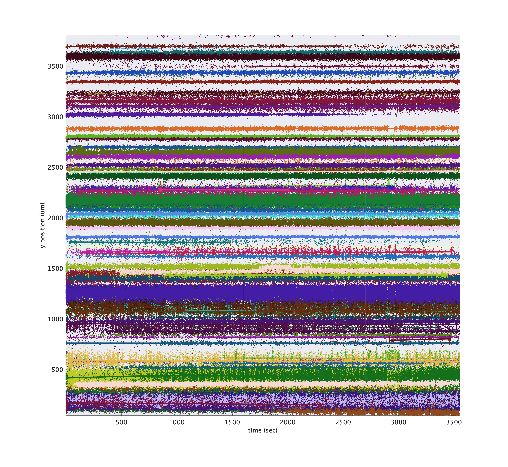

# Analysis of Kilosort Results

## Simple statistics

Simple statistics for a KilosortDataset can be computed / printed using:

```matlab
>> stats = ks.computeBasicStats();
>> ks.printBasicStats();
neuropixel_01: 3747.1 sec, 8181228 (6974070) spikes, 592 (187) clusters (with fr > 3 Hz)

>> stats
stats =

  struct with fields:

          spike_clusters: [8181228×1 uint32]
             cluster_ids: [592×1 uint32]
                  offset: 0
             sample_rate: 30000
             spike_times: [8181228×1 uint64]
                 nSpikes: 8181228
               nClusters: 592
                    nSec: 3.7471e+03
                      fr: [1×591 double]
                  thresh: 3
             clusterMask: [1×591 logical]
    nClustersAboveThresh: 187
      nSpikesAboveThresh: 6974070
```

## KilosortMetrics

More computed statistics can be computed on demand by calling:

```matlab
metrics = ks.computeMetrics();
```

which returns a `Neuropixel.KilosortMetrics` instance. This is a catch-all class for storing all the statistics we want to compute about the results of a Kilosort run. At the moment, most of these properties are related to localizing spikes / templates / clusters in spatial coordinates on the probe. The details of these computations borrow heavily from code written by Nick Steinmetz described on the [Neuropixels wiki](https://github.com/cortex-lab/neuropixels/wiki/Other_analysis_methods).

Many properties are computed for each cluster, for each template (as multiple templates may comprise each cluster), and for each individual spike.

* Spatial location properties end in `_centerOfMass`, and have x,y (and someday z) along the second dimension
* `depth` properties are shorthands for the `y` spatial dimension of `centerOfMass`
* `waveform` properties store the template-derived waveform taken from the largest channel
* `best_channels` properties indicate which channels best capture the electrical image of a given template or cluster. * `amplitude` properties are already in uV
* `is_localized` properties indicate whether the electrical image is sufficiently well localized in space

  KilosortMetrics with properties:

```
                           ks: [1×1 Neuropixel.KilosortDataset]
                      nSpikes: 8181228
              nChannelsSorted: 371
                   nTemplates: 653
          nTemplateTimepoints: 82
                    nClusters: 592
           nConcatenatedFiles: 1
       maxTemplatesPerCluster: 11
                           fs: 30000
                   channelMap: [1×1 Neuropixel.ChannelMap]
                  channel_ids: [nChannelsSorted × 1 uint32]
          concatenatedSamples: 112412208
           concatenatedStarts: 1
            concatenatedNames: "neuropixel_01"

                 template_unw: [nTemplates × nTemplateTimepoints × nChannelsSorted single] % unwhitened templates in original data scale
              template_scaled: [nTemplates × nTemplateTimepoints × nChannelsSorted single] % unwhitened, scaled templates in uV

        template_centerOfMass: [nTemplates × 2 single]
        template_is_localized: [nTemplates × 1 logical]
            template_waveform: [nTemplates × nTemplateTimepoints single]
         template_waveform_ch: [nTemplates × 1 uint32]
           template_amplitude: [nTemplates × 1 single]
                 template_ttp: [nTemplates × 1 single]
       template_best_channels: [nTemplates × nChannelsSorted uint32]

                  spike_times: [nSpikes × 1 uint64]
              spike_amplitude: [nSpikes × 1 single]
           spike_centerOfMass: [nSpikes × 2 single] % x, y
              spike_templates: [nSpikes × 1 uint32]
               spike_clusters: [nSpikes × 1 uint32]
               spike_depth: [nSpikes × 1 single]
        spike_is_localized: [nSpikes × 1 logical]

                  cluster_ids: [nClusters × 1 uint32]
    cluster_template_mostUsed: [nClusters × 1 uint32]
        cluster_template_list: {nClusters × 1 cell}
    cluster_template_useCount: [nClusters × nTemplates uint64]
        cluster_num_templates: [nClusters × 1 uint32]
        cluster_best_channels: [nClusters × nChannelsSorted uint32]
         cluster_centerOfMass: [nClusters × 2 single] % x, y
         cluster_is_localized: [nClusters × 1 logical]
             cluster_waveform: [nClusters × nTemplateTimepoints × maxTemplatesPerCluster single]
          cluster_waveform_ch: [nClusters × nClusters uint32]
            cluster_amplitude: [nClusters × 1 single]
                  cluster_ttp: [nClusters × 1 single]
                cluster_depth: [nClusters × 1 single]
```

### Plotting drift maps

A drift map plots the spatial depth of all spikes over time as individual dots, where the dot color darkness increases for large amplitude spikes, allowing the eye to follow bands of spikes over time. The code for generating this plot was largely copied from the [Cortex lab spikes repo](https://github.com/cortex-lab/spikes) and modified to use the KilosortMetrics structure and add some additional metadata.

You can plot a standard driftmap using:

```matlab
metrics.plotDriftmap();
```


Significant drift events are marked in red in the raster and shown as red ticks above. You can set the driftThreshold in µm for drift events as a parameter, as well as lower the threshold for spike amplitude quantile to include smaller spikes in the calculation:

```matlab
metrics.plotDriftmap('driftThreshold', 4, 'spikeAmpQuantile', 0.8);
```


If you have [computed trial segmentation boundaries](/kilosort/#segmenting-a-kilosort-dataset-into-trials) stored in a [`TrialSegmentationInfo`](/kilosort/#trialsegmentationinfo) instance, you can pass them in to show the trial boundaries as blue ticks at the bottom.

```matlab
metrics.plotDriftmap('tsi', tsi);
```


As you can see, the vertical bands where spiking activity look very different from other timepoints occur when no trials were present. Indeed, these were time periods where the task was paused and the subject was asleep. We can mask out these regions to better assess drift over the time periods we're most concerned with:

```matlab
metrics.plotDriftmap('tsi', tsi, 'maskRegionsOutsideTrials', true);
```


Or we can excise those regions of time for plotting purposes only, to simulate what would happen [if we excised those regions during pre-processing](/imec_dataset/#excising-time-windows). Locations where timepoints are spliced together are indicated using magenta lines.

```matlab
metrics.plotDriftmap('tsi', tsi, 'exciseRegionsOutsideTrials', true);
```


### Plotting cluster drift maps

The driftmaps can help the eye spot points where spikes shift in space, but they do not indicate where Kilosort may have split a cluster over time. `metrics.plotClusterDriftmap` is similar to `plotDriftmap` except that it colors each dot according to cluster id. For these plots, it is helpful to subselect a subset of cluster ids to keep the plots from being too dense. Cluster ids tend to be roughly in order along the probe because of Kilosort's algorithm, so be sure to sample uniformly over the cluster ids when subselecting.

```matlab
cluster_ids = metrics.cluster_ids(1:5:metrics.nClusters);
metrics.plotDriftmap('tsi', tsi, 'exciseRegionsOutsideTrials', true, 'cluster_ids', cluster_ids);
```


!!!tip "Hover over tool tips"
    For these plots, in newer versions of Matlab, you can hover over points in the plot to see a popup tooltip that will display information about the cluster to which that point belongs.

You can also tweak the colors of each cluster so that larger amplitude clusters appear brighter using `'colorByAmp', true`.

```matlab
metrics.plotDriftmap('tsi', tsi, 'exciseRegionsOutsideTrials', true, 'cluster_ids', cluster_ids, 'colorByAmp', true);
```



By default, larger clusters are plotted on top, but you can randomize the plotting order using `'zShuffleClusters', true`. Instead of plotting each individual spike, you can plot a smoothed estimate of cluster depth by passing `'showSmooth', true, 'showIndividual', false`:

```matlab
metrics.plotDriftmap('tsi', tsi, 'exciseRegionsOutsideTrials', true, 'cluster_ids', cluster_ids, ...
    'showSmooth', true, 'showIndividual', false, 'smoothWidthSeconds', 50);
```


### Plotting cluster centers of mass

To see the distribution of cluster waveforms over the probe:

```matlab
metrics.plotClusterWaveformAtCentroid()
```


!!!tip "Hover over tool tips"
    For these plots, in newer versions of Matlab, you can hover over waveforms in the plot to see a popup tooltip that will display information about the cluster to which that waveform belongs.

    <center>
    
    </center>

### Plotting electrical images

You can plot the electrical image of each cluster's templates (or an individual template) as well, using `ymag` and `xmag` to zoom in after normalizing.

```matlab
cluster_id = 10;
metrics.plotClusterImage(cluster_id, 'ymag', 10, 'xmag', 2)
```


Rather than plotting every channel, you can select the best N contiguous channels:

```matlab
metrics.plotClusterImage(cluster_id, 'best_n_channels', 20);
```


